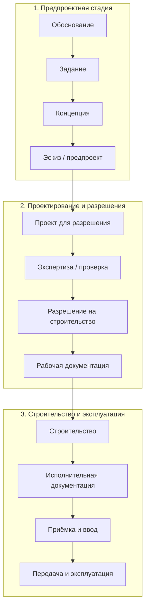

---
hide:
  - toc
---

# Стадии проектирования и строительства

!!! warning "Статус: черновик"
    Названия стадий записаны по первичному обзору и статье 2014 г. (см. [Источники](../istochniki.md)). Каждую ячейку нужно сверить с действующим текстом норматива, пока не проставлен статус **сверено**.

## Принцип построения

Строки — **объединение** стадий всех стран, а не пересечение. Если у страны есть стадия без аналога, для неё добавлена отдельная строка, а у остальных стоит «—» с пометкой, где эта работа делается у них.

**Обозначения:** ≈ полный аналог · ◐ частичный аналог · — аналога нет · 🔸 стадия есть только у одной страны

## Сводная матрица

| № | Сквозная стадия | 🇷🇺 Россия | 🇷🇸 Сербия | 🇪🇺 ЕС (EN 16310) | 🇬🇧 Англия (RIBA 2020) |
|--:|---|---|---|---|---|
| 1 | Стратегия и обоснование | — (обязательной стадии нет; обоснование инвестиций и ТЭО не входят в состав проектной документации) <small>Источник: [ГрК РФ ст. 48 ч. 12–13](https://www.consultant.ru/document/cons_doc_LAW_51040/b884020ea7453099ba8bc9ca021b84982cadea7d/)</small> | — (в составе предпроектных работ) | — (вне EN 16310; см. примечание) | ≈ **0** Strategic Definition — стратегическое определение |
| 2 | Подготовка задания | ◐ задание на проектирование — исходные данные для ПД; градостроительный план земельного участка прикладывается к заявлению о разрешении (выдан не ранее чем за 3 года) <small>Источник: [ГрК РФ ст. 48 ч. 11](https://www.consultant.ru/document/cons_doc_LAW_51040/b884020ea7453099ba8bc9ca021b84982cadea7d/); [ст. 51 ч. 7](https://grkodeksrf.ru/gl-6/st-51-grk-rf)</small> | ◐ *lokacijski uslovi* — локационные условия | — | ≈ **1** Preparation and Briefing — подготовка и формирование задания |
| 3 | Концепция | ◐ на практике — АГК (архитектурно-градостроительная концепция). В Москве Архитектурная комиссия рассматривает концепции, в том числе архитектурно-градостроительного развития территории и архитектурно-художественные концепции зданий; в ГрК РФ как стадия концепция не предусмотрена <small>Источник: [mos.ru/dgp, Архитектурная комиссия](https://www.mos.ru/dgp/function/arkhitekturnaya-komissiya-po-rassmotreniyu-proektnykh-materialov/deyatelnost-arkhitekturnoi-komissii-po-rassmotreniyu-proektnykh-materialov/); ПП Москвы № 1423-ПП, п. 2.1.2</small> | ≈ *idejno rešenje* — идейное решение | ≈ Preliminary Design — предварительное проектирование | ≈ **2** Concept Design — концептуальное проектирование |
| 4 | Эскиз / предварительный проект | ◐ эскизный проект (ЭП) или ТЭО — на практике предварительная стадия перед П; в ГрК РФ не закреплена <small>Источник: ГрК РФ ст. 48 (стадии ЭП в тексте нет). Практика: [teoc.ru](https://www.teoc.ru/blog/articles/stadii-proektirovaniya-zdanij)</small> | ≈ *idejni projekat* — эскизный проект | ≈ Scheme Design — эскизное проектирование | ◐ **2** Concept Design (окончание) |
| 5 | Согласование архитектурного облика | 🔸 **АГО** — федеральное согласование архитектурно-градостроительного облика (ст. 40.1 ГрК РФ, до 10 рабочих дней). В Москве **АГР**: Архитектурная комиссия → совещание с участием Мэра → свидетельство об утверждении АГР. Направляется заявителю в личный кабинет в течение 2 рабочих дней после протокола совещания (госуслуга по оформлению упразднена с 30.09.2026). Получается **до экспертизы** проектной документации; действует 3 года; не требуется для ОКН и ИЖС; рассмотрение на Комиссии — до 12 рабочих дней; при существенных изменениях проекта нужно новое согласование <small>Источник: [ПП Москвы от 22.05.2026 № 1423-ПП (ред. от 13.08.2026)](https://www.mos.ru/dgp/function/arkhitekturnaya-komissiya-po-rassmotreniyu-proektnykh-materialov/deyatelnost-arkhitekturnoi-komissii-po-rassmotreniyu-proektnykh-materialov/), Положение п. 1.2, 1.4, 1.6, 1.7, 1.9, 3.5, Порядок п. 5.5; [ГрК РФ ст. 40.1](https://grkodeksrf.ru/gl-4/st-40-1-grk-rf)</small> | — | — | ◐ planning permission (не сверено) |
| 6 | Проект для разрешения | ≈ проектная документация; состав разделов определяет Правительство РФ <small>Источник: [ГрК РФ ст. 48](https://www.consultant.ru/document/cons_doc_LAW_51040/b884020ea7453099ba8bc9ca021b84982cadea7d/); [ПП РФ № 87 от 16.02.2008](http://government.ru/docs/all/63014/)</small> | ≈ *projekat za građevinsku dozvolu* — проект для разрешения на строительство | ≈ Technical Design — техническое проектирование | ◐ **3** Spatial Coordination — пространственная координация; подача на planning permission |
| 7 | Проверка / экспертиза проекта | 🔸 государственная или негосударственная экспертиза проектной документации и инженерных изысканий; обязательна, если нужно разрешение на строительство, кроме случаев ч. 2, 2.1, 2.2, 3 ст. 49 <small>Источник: [ГрК РФ ст. 49](https://www.consultant.ru/document/cons_doc_LAW_51040/4ca003dd6b793db91e6027babe790a482edd9b7e/)</small> | ◐ *tehnička kontrola projekta* — техническая проверка проекта | — (определяется национальным правом) | ◐ согласование Building Control; для high-risk зданий — гейты Building Safety Regulator |
| 8 | Разрешение на строительство | ≈ разрешение на строительство; к заявлению прилагаются ГПЗУ, материалы ПД и положительное заключение экспертизы <small>Источник: [ГрК РФ ст. 51](https://grkodeksrf.ru/gl-6/st-51-grk-rf)</small> | ≈ *građevinska dozvola* — разрешение на строительство | — (национальное право) | ◐ planning permission + Building Regulations approval |
| 9 | Рабочая документация | ≈ рабочая документация — по ней ведётся строительство; ПД утверждается застройщиком после положительного заключения экспертизы <small>Источник: [ГрК РФ ст. 48 ч. 15](https://www.consultant.ru/document/cons_doc_LAW_51040/b884020ea7453099ba8bc9ca021b84982cadea7d/)</small> | ≈ *projekat za izvođenje* — проект для производства работ | ≈ Production Information — информация для производства работ | ≈ **4** Technical Design — техническое проектирование |
| 10 | Строительство | ≈ строительство (члены СРО), извещение о начале работ, строительный контроль, государственный строительный надзор для объектов с обязательной экспертизой <small>Источник: [ст. 52](https://grkodeksrf.ru/gl-6/st-52-grk-rf); [ст. 53](https://grkodeksrf.ru/gl-6/st-53-grk-rf); [ст. 54](https://grkodeksrf.ru/gl-6/st-54-grk-rf)</small> | ≈ *izvođenje radova* — производство работ (с *prijava radova* — уведомлением о начале) | ≈ Construction — строительство | ≈ **5** Manufacturing and Construction — изготовление и строительство |
| 11 | Исполнительная документация | ≈ исполнительная документация и акты освидетельствования ведёт лицо, осуществляющее строительство <small>Источник: [ГрК РФ ст. 52](https://grkodeksrf.ru/gl-6/st-52-grk-rf); [ст. 53](https://grkodeksrf.ru/gl-6/st-53-grk-rf)</small> | ≈ *projekat izvedenog objekta* — проект построенного объекта | — | ◐ as-built information (в составе стадии 6) |
| 12 | Приёмка и разрешение на ввод | ≈ заключение органа госстройнадзора о соответствии (ст. 54) → разрешение на ввод в эксплуатацию (ст. 55); к заявлению: ГПЗУ-документы, разрешение на строительство, акт подключения, схема, заключение, технический план <small>Источник: [ст. 54](https://grkodeksrf.ru/gl-6/st-54-grk-rf); [ст. 55](https://grkodeksrf.ru/gl-6/st-55-grk-rf)</small> | ≈ *tehnički pregled* — техническая приёмка; *upotrebna dozvola* — разрешение на использование | — (национальное право) | ◐ completion certificate / final certificate |
| 13 | Передача заказчику | — (ГрК РФ отдельной стадии не выделяет; не сверено) | — | ◐ Handover | ≈ **6** Handover — передача объекта |
| 14 | Эксплуатация | ◐ эксплуатация зданий регулируется отдельно; не сверено | — (вне регулирования стадий) | ◐ Use (вне объёма стадий) | 🔸 **7** Use — эксплуатация (внутри Plan of Work) |

!!! note "Как читать"
    Ячейки с **—** означают, что отдельной стадии в этой системе нет. Это не значит, что работа не выполняется: она может входить в соседнюю стадию или регулироваться национальным правом. Уточняется в карточках стран.

## Стадии, не имеющие аналога у остальных

| Стадия | Страна | Чем отличается |
|---|---|---|
| Стратегическое определение (RIBA 0) | 🇬🇧 | Отдельная стадия до формирования задания |
| Экспертиза проектной документации | 🇷🇺 | Обязательная процедура вне проектных стадий, отдельный орган и заключение |
| Стадия эксплуатации (RIBA 7) | 🇬🇧 | Входит в план работ архитектора |
| Гейты Building Safety Regulator | 🇬🇧 | Только для зданий повышенной категории риска |
| Локационные условия | 🇷🇸 | Предшествуют проектированию, выдаются органом |
| АГО (федерально) и АГР (Москва) | 🇷🇺 | Согласование архитектурного облика до экспертизы и разрешения на строительство; в Москве АГР рассматривается Архитектурной комиссией и совещанием с участием Мэра (ПП Москвы № 1423-ПП) |

## Схема

## Россия: итоги сверки

Статус: **сверено частично** (дата проверки: 2026-10-03). Читались тексты статей ГрК РФ на consultant.ru и grkodeksrf.ru, текст ГОСТ Р 55654-2013.

!!! warning "Исправление: ГОСТ Р 55654-2013"
    Ранее колонка RU ссылалась на «концепцию проекта / предварительный проект» по ГОСТ Р 55654-2013. По тексту стандарта (идентичен ИСО 16813:2006, «Проектирование зданий с учетом экологических требований. Внутренняя среда. Общие принципы», [docs.cntd.ru](http://docs.cntd.ru/document/1200105930)) он описывает процесс проектирования *внутренней среды* здания в четыре стадии: I — формулирование задания на проектирование; II — принципиальные решения (схематическое проектирование); III — детальное проектирование; IV — окончательное проектирование. Это не стадии проектной документации по ГрК РФ, и сопоставлять их со стадиями «ПД / РД» напрямую нельзя. Статья 2014 г. эту подмену допускает.

Что подтверждено:

- в российской практике перед стадией **П** (проектная документация) работают с архитектурно-градостроительной концепцией (АГК), эскизным проектом или ТЭО; это практика, а не стадии ГрК РФ. После **П** идёт стадия **Р / РД** (рабочая документация);
- в ГрК РФ две проектные стадии: проектная документация (ст. 48; состав разделов — ПП РФ № 87) и рабочая документация;
- экспертиза ПД — ст. 49, разрешение на строительство — ст. 51, строительный контроль и надзор — ст. 53–54, разрешение на ввод — ст. 55;
- ГОСТ Р 21.1101-2013 заменён ГОСТ Р 21.101-2020 (приказ Росстандарта от 23.06.2020 № 282-ст, [Гарант](https://base.garant.ru/74691448/)); дату введения в силу ещё нужно уточнить: источники расходятся (2021 / 2024).

Москва: АГК/АГР сверены по официальной странице ДГП и тексту ПП Москвы № 1423-ПП от 22.05.2026 (действует с 30.09.2026; коммерческие сайты ссылаются на более ранний ПП 284-ПП от 30.04.2013; его текущий статус не сверен).

Не сверено: порядок обоснования инвестиций для бюджетных объектов, ст. 55.24 (эксплуатация), статусы СП и ГОСТ по стадиям.

## Что предстоит сверить

- [ ] EN 16310:2013 — состав подстадий и пометки Design
- [x] Россия: ГрК РФ ст. 48–55, ГОСТ Р 55654-2013 — сверено частично (см. выше); [ ] дата введения ГОСТ Р 21.101-2020, ст. 55.24, обоснование инвестиций
- [ ] Сербия: закон о планировании и строительстве и правилник о содержании технической документации — названия и состав проектов
- [ ] RIBA Plan of Work 2020 — названия стадий, планируемые соответствия
- [ ] Британские гейты Building Safety Regulator: условия применимости
