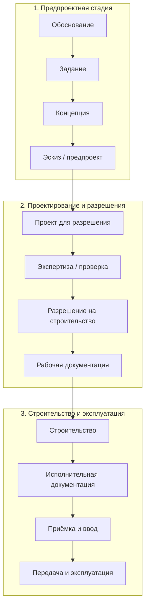

---
hide:
  - toc
---

# Стадии проектирования и строительства

!!! warning "Статус: черновик"
    Названия стадий записаны по первичному обзору и статье 2014 г. (см. [Источники](../istochniki.md)). Каждую ячейку нужно сверить с действующим текстом норматива, пока не проставлен статус **сверено**.

## Принцип построения

Название каждой стадии в матрице — ссылка на страницу с составом работ, документами и уровнем детализации по странам (вкладки 🇷🇺 🇷🇸 🇪🇺 🇬🇧).

Строки — **объединение** стадий всех стран, а не пересечение. Если у страны есть стадия без аналога, для неё добавлена отдельная строка, а у остальных стоит «—» с пометкой, где эта работа делается у них.

**Обозначения:** ≈ полный аналог · ◐ частичный аналог · — аналога нет · 🔸 стадия есть только у одной страны

## Сводная матрица

| № | Сквозная стадия | 🇷🇺 Россия | 🇷🇸 Сербия | 🇪🇺 ЕС (EN 16310) | 🇬🇧 Англия (RIBA 2020) |
|--:|---|---|---|---|---|
| 1 | [Стратегия и обоснование](../stadii/01-strategiya.md) | ◐ практика: маркетинговое исследование, концепция девелопмента; нормативной стадии нет <small>[ГрК РФ ст. 48](https://www.consultant.ru/document/cons_doc_LAW_51040/b884020ea7453099ba8bc9ca021b84982cadea7d/)</small> | ◐ *GNP* (генеральный проект), предварительное ТЭО, ТЭО <small>[Правилник чл. 2, 14, 34](https://www.paragraf.rs/propisi/pravilnik-o-sadrzini-nacinu-i-postupku-izrade-i-nacinu-vrsenja-kontrole-tehnicke-dokumentacije-prema-klasi-i-nameni-objekata.html); [Закон чл. 112–117](https://www.paragraf.rs/propisi/zakon_o_planiranju_i_izgradnji.html)</small> | ≈ **0** Initiative <small>[отчёт ACE 2013](https://oar.archi/wp-content/uploads/2021/03/the_design_and_construction_phases_of_a_construction_project_pdf_1478002177.pdf); [EN 16310 (iTeh)](https://standards.iteh.ai/catalog/standards/cen/7250e686-1a17-446c-bc6a-754708162070/en-16310-2013)</small> | ≈ **0** Strategic Definition <small>[RIBA Plan of Work 2020](https://www.riba.org/media/syneeeto/2020ribaplanofworkoverviewpdf.pdf)</small> |
| 2 | [Подготовка задания](../stadii/02-zadanie.md) | ◐ ТЗ на проектирование, ГПЗУ, ТУ, изыскания <small>[ПП РФ № 87](https://mchs.gov.ru/dokumenty/697) п. 10; [ГрК РФ ст. 48](https://www.consultant.ru/document/cons_doc_LAW_51040/b884020ea7453099ba8bc9ca021b84982cadea7d/) ч. 11</small> | ◐ *lokacijski uslovi* — локационные условия (на основе IDR), срок 5 рабочих дней <small>[Закон чл. 53а, 55–56, 8д](https://www.paragraf.rs/propisi/zakon_o_planiranju_i_izgradnji.html); [Правилник чл. 15](https://www.paragraf.rs/propisi/pravilnik-o-sadrzini-nacinu-i-postupku-izrade-i-nacinu-vrsenja-kontrole-tehnicke-dokumentacije-prema-klasi-i-nameni-objekata.html)</small> | ≈ **1** Initiation <small>[отчёт ACE 2013](https://oar.archi/wp-content/uploads/2021/03/the_design_and_construction_phases_of_a_construction_project_pdf_1478002177.pdf); [EN 16310 (iTeh)](https://standards.iteh.ai/catalog/standards/cen/7250e686-1a17-446c-bc6a-754708162070/en-16310-2013)</small> | ≈ **1** Preparation and Briefing <small>[RIBA Plan of Work 2020](https://www.riba.org/media/syneeeto/2020ribaplanofworkoverviewpdf.pdf)</small> |
| 3 | [Концепция](../stadii/03-koncepciya.md) | ◐ АГК (практика Москвы) <small>[mos.ru/dgp](https://www.mos.ru/dgp/function/arkhitekturnaya-komissiya-po-rassmotreniyu-proektnykh-materialov/deyatelnost-arkhitekturnoi-komissii-po-rassmotreniyu-proektnykh-materialov/)</small> | ≈ *IDR* — идейное решение <small>[Правилник чл. 15, 35–41](https://www.paragraf.rs/propisi/pravilnik-o-sadrzini-nacinu-i-postupku-izrade-i-nacinu-vrsenja-kontrole-tehnicke-dokumentacije-prema-klasi-i-nameni-objekata.html); [Закон чл. 117а](https://www.paragraf.rs/propisi/zakon_o_planiranju_i_izgradnji.html)</small> | ≈ **2.1** Conceptual Design <small>[отчёт ACE 2013](https://oar.archi/wp-content/uploads/2021/03/the_design_and_construction_phases_of_a_construction_project_pdf_1478002177.pdf)</small> | ≈ **2** Concept Design <small>[RIBA Plan of Work 2020](https://www.riba.org/media/syneeeto/2020ribaplanofworkoverviewpdf.pdf)</small> |
| 4 | [Эскиз / предварительный проект](../stadii/04-eskiz.md) | ◐ ЭП / ТЭО — практика, в ГрК нет <small>[ГрК РФ ст. 48](https://www.consultant.ru/document/cons_doc_LAW_51040/b884020ea7453099ba8bc9ca021b84982cadea7d/)</small> | ≈ *IDP* — эскизный проект <small>[Правилник чл. 16, 42–49](https://www.paragraf.rs/propisi/pravilnik-o-sadrzini-nacinu-i-postupku-izrade-i-nacinu-vrsenja-kontrole-tehnicke-dokumentacije-prema-klasi-i-nameni-objekata.html); [Закон чл. 118](https://www.paragraf.rs/propisi/zakon_o_planiranju_i_izgradnji.html)</small> | ≈ **2.2** Preliminary Design <small>[отчёт ACE 2013](https://oar.archi/wp-content/uploads/2021/03/the_design_and_construction_phases_of_a_construction_project_pdf_1478002177.pdf)</small> | ◐ **2** Concept Design (окончание) <small>[RIBA Plan of Work 2020](https://www.riba.org/media/syneeeto/2020ribaplanofworkoverviewpdf.pdf)</small> |
| 5 | [Согласование архитектурного облика](../stadii/05-ago-agr.md) | 🔸 АГО (федерально), в Москве АГР <small>[ГрК ст. 40.1](https://grkodeksrf.ru/gl-4/st-40-1-grk-rf); [ПП Москвы № 1423-ПП](https://www.mos.ru/dgp/function/arkhitekturnaya-komissiya-po-rassmotreniyu-proektnykh-materialov/deyatelnost-arkhitekturnoi-komissii-po-rassmotreniyu-proektnykh-materialov/)</small> | — | — | ◐ planning permission (⏳) <small>[RIBA Plan of Work 2020](https://www.riba.org/media/syneeeto/2020ribaplanofworkoverviewpdf.pdf)</small> |
| 6 | [Проект для разрешения](../stadii/06-proekt-razresheniya.md) | ≈ проектная документация (12 разделов) <small>[ПП РФ № 87](https://mchs.gov.ru/dokumenty/697); [ГрК РФ ст. 48](https://www.consultant.ru/document/cons_doc_LAW_51040/b884020ea7453099ba8bc9ca021b84982cadea7d/)</small> | ≈ *PGD* — проект для разрешения на строительство <small>[Правилник чл. 17, 51–57](https://www.paragraf.rs/propisi/pravilnik-o-sadrzini-nacinu-i-postupku-izrade-i-nacinu-vrsenja-kontrole-tehnicke-dokumentacije-prema-klasi-i-nameni-objekata.html); [Закон чл. 118а](https://www.paragraf.rs/propisi/zakon_o_planiranju_i_izgradnji.html)</small> | ◐ **2.2–2.3**; пакет подаётся в конце Preliminary Design (пример Франции) <small>[отчёт ACE 2013](https://oar.archi/wp-content/uploads/2021/03/the_design_and_construction_phases_of_a_construction_project_pdf_1478002177.pdf)</small> | ◐ **3** Spatial Coordination; Planning Application в конце стадии <small>[RIBA Plan of Work 2020](https://www.riba.org/media/syneeeto/2020ribaplanofworkoverviewpdf.pdf)</small> |
| 7 | [Проверка / экспертиза проекта](../stadii/07-ekspertiza.md) | 🔸 экспертиза проектной документации и изысканий <small>[ст. 49](https://www.consultant.ru/document/cons_doc_LAW_51040/4ca003dd6b793db91e6027babe790a482edd9b7e/)</small> | ◐ *tehnička kontrola* PGD; *revizija* GNP и IDP <small>[Правилник чл. 79–86](https://www.paragraf.rs/propisi/pravilnik-o-sadrzini-nacinu-i-postupku-izrade-i-nacinu-vrsenja-kontrole-tehnicke-dokumentacije-prema-klasi-i-nameni-objekata.html); [Закон чл. 129, 131](https://www.paragraf.rs/propisi/zakon_o_planiranju_i_izgradnji.html)</small> | — (национальное право; пример Франции: technical controller) <small>[отчёт ACE 2013](https://oar.archi/wp-content/uploads/2021/03/the_design_and_construction_phases_of_a_construction_project_pdf_1478002177.pdf)</small> | ◐ Building Control; для high-risk — гейты BSR <small>[RIBA Plan of Work 2020](https://www.riba.org/media/syneeeto/2020ribaplanofworkoverviewpdf.pdf); [BSA](https://www.thebesa.com/building-safety-act/gateways)</small> |
| 8 | [Разрешение на строительство](../stadii/08-razreshenie.md) | ≈ разрешение на строительство <small>[ГрК РФ ст. 51](https://grkodeksrf.ru/gl-6/st-51-grk-rf)</small> | ≈ *građevinska dozvola* — разрешение на строительство, срок 5 рабочих дней <small>[Закон чл. 135, 8д](https://www.paragraf.rs/propisi/zakon_o_planiranju_i_izgradnji.html); [Правилник чл. 17](https://www.paragraf.rs/propisi/pravilnik-o-sadrzini-nacinu-i-postupku-izrade-i-nacinu-vrsenja-kontrole-tehnicke-dokumentacije-prema-klasi-i-nameni-objekata.html)</small> | — *Statutory approval*: национальное право <small>[EN 16310 (iTeh)](https://standards.iteh.ai/catalog/standards/cen/7250e686-1a17-446c-bc6a-754708162070/en-16310-2013); [отчёт ACE 2013](https://oar.archi/wp-content/uploads/2021/03/the_design_and_construction_phases_of_a_construction_project_pdf_1478002177.pdf)</small> | ◐ planning permission + Building Regulations (заявка на стадии 4) <small>[RIBA Plan of Work 2020](https://www.riba.org/media/syneeeto/2020ribaplanofworkoverviewpdf.pdf)</small> |
| 9 | [Рабочая документация](../stadii/09-rabochaya.md) | ≈ рабочая документация (РД) <small>[ГОСТ Р 21.101-2020](https://meganorm.ru/Data2/1/4293720/4293720404.htm) п. 4.2; [ГрК РФ ст. 48](https://www.consultant.ru/document/cons_doc_LAW_51040/b884020ea7453099ba8bc9ca021b84982cadea7d/)</small> | ≈ *PZI* — проект для производства работ <small>[Правилник чл. 18, 61–70](https://www.paragraf.rs/propisi/pravilnik-o-sadrzini-nacinu-i-postupku-izrade-i-nacinu-vrsenja-kontrole-tehnicke-dokumentacije-prema-klasi-i-nameni-objekata.html); [Закон чл. 123](https://www.paragraf.rs/propisi/zakon_o_planiranju_i_izgradnji.html)</small> | ≈ **2.3** Developed, **2.4** Technical Design/FEED, **2.5** Detailed Engineering <small>[отчёт ACE 2013](https://oar.archi/wp-content/uploads/2021/03/the_design_and_construction_phases_of_a_construction_project_pdf_1478002177.pdf)</small> | ≈ **4** Technical Design <small>[RIBA Plan of Work 2020](https://www.riba.org/media/syneeeto/2020ribaplanofworkoverviewpdf.pdf)</small> |
| 10 | [Строительство](../stadii/10-stroitelstvo.md) | ≈ строительство, стройконтроль, надзор (ГСН) <small>[ст. 52](https://grkodeksrf.ru/gl-6/st-52-grk-rf); [53](https://grkodeksrf.ru/gl-6/st-53-grk-rf); [54](https://grkodeksrf.ru/gl-6/st-54-grk-rf)</small> | ≈ *izvođenje radova* — *prijava radova* (уведомление о начале), *stručni nadzor* <small>[Закон чл. 148–153](https://www.paragraf.rs/propisi/zakon_o_planiranju_i_izgradnji.html)</small> | ≈ **3** Procurement, **4.1–4.2** Pre-construction, Construction <small>[отчёт ACE 2013](https://oar.archi/wp-content/uploads/2021/03/the_design_and_construction_phases_of_a_construction_project_pdf_1478002177.pdf)</small> | ≈ **5** Manufacturing and Construction <small>[RIBA Plan of Work 2020](https://www.riba.org/media/syneeeto/2020ribaplanofworkoverviewpdf.pdf)</small> |
| 11 | [Исполнительная документация](../stadii/11-ispolnitelnaya.md) | ≈ исполнительная документация, акты освидетельствования <small>[ст. 52](https://grkodeksrf.ru/gl-6/st-52-grk-rf); [53](https://grkodeksrf.ru/gl-6/st-53-grk-rf)</small> | ≈ *PIO* — проект построенного объекта <small>[Правилник чл. 19, 71–78](https://www.paragraf.rs/propisi/pravilnik-o-sadrzini-nacinu-i-postupku-izrade-i-nacinu-vrsenja-kontrole-tehnicke-dokumentacije-prema-klasi-i-nameni-objekata.html); [Закон чл. 124](https://www.paragraf.rs/propisi/zakon_o_planiranju_i_izgradnji.html)</small> | — (⏳ не сверено) | ◐ Verified Construction Information (стадия 5) <small>[RIBA Plan of Work 2020](https://www.riba.org/media/syneeeto/2020ribaplanofworkoverviewpdf.pdf)</small> |
| 12 | [Приёмка и разрешение на ввод](../stadii/12-priemka-vvod.md) | ≈ заключение о соответствии → разрешение на ввод <small>[ст. 54](https://grkodeksrf.ru/gl-6/st-54-grk-rf); [55](https://grkodeksrf.ru/gl-6/st-55-grk-rf)</small> | ≈ *tehnički pregled* → *upotrebna dozvola*, срок 5 рабочих дней <small>[Закон чл. 154–158](https://www.paragraf.rs/propisi/zakon_o_planiranju_i_izgradnji.html)</small> | ◐ **4.3** Commissioning, **4.5** Regulatory approval <small>[отчёт ACE 2013](https://oar.archi/wp-content/uploads/2021/03/the_design_and_construction_phases_of_a_construction_project_pdf_1478002177.pdf)</small> | ◐ Practical Completion (конец стадии 5) <small>[RIBA Plan of Work 2020](https://www.riba.org/media/syneeeto/2020ribaplanofworkoverviewpdf.pdf)</small> |
| 13 | [Передача заказчику](../stadii/13-peredacha.md) | — (⏳ ГрК стадии не выделяет) | — | ≈ **4.4** Hand over <small>[отчёт ACE 2013](https://oar.archi/wp-content/uploads/2021/03/the_design_and_construction_phases_of_a_construction_project_pdf_1478002177.pdf)</small> | ≈ **6** Handover <small>[RIBA Plan of Work 2020](https://www.riba.org/media/syneeeto/2020ribaplanofworkoverviewpdf.pdf)</small> |
| 14 | [Эксплуатация](../stadii/14-ekspluatatsiya.md) | ◐ отдельное регулирование (⏳) | ◐ владелец обеспечивает содержание и осмотры объекта <small>[Закон чл. 159](https://www.paragraf.rs/propisi/zakon_o_planiranju_i_izgradnji.html)</small> | ≈ **5** Usage, **6** End of life <small>[отчёт ACE 2013](https://oar.archi/wp-content/uploads/2021/03/the_design_and_construction_phases_of_a_construction_project_pdf_1478002177.pdf)</small> | 🔸 **7** Use (внутри плана работ) <small>[RIBA Plan of Work 2020](https://www.riba.org/media/syneeeto/2020ribaplanofworkoverviewpdf.pdf)</small> |

!!! note "Как читать"
    Ячейки с **—** означают, что отдельной стадии в этой системе нет. Это не значит, что работа не выполняется: она может входить в соседнюю стадию или регулироваться национальным правом. Уточняется в карточках стран.

## Стадии, не имеющие аналога у остальных

| Стадия | Страна | Чем отличается |
|---|---|---|
| Девелоперская концепция и маркетинговое задание (RU), Strategic Definition (UK, RIBA 0) | 🇷🇺 🇬🇧 | В России ближайший аналог — практика девелопера и заказчика (маркетинг, функции, площади, зонирование), нормативно не закреплённая; в RIBA 0 — отдельная стадия плана работ; в EN 16310 — стадии Initiative и Initiation |
| Экспертиза проектной документации | 🇷🇺 | Обязательная процедура вне проектных стадий, отдельный орган и заключение |
| Стадия эксплуатации (RIBA 7) | 🇬🇧 | Входит в план работ архитектора |
| Гейты Building Safety Regulator | 🇬🇧 | Только для зданий повышенной категории риска |
| Локационные условия | 🇷🇸 | Предшествуют проектированию, выдаются органом |
| АГО (федерально) и АГР (Москва) | 🇷🇺 | Согласование архитектурного облика до экспертизы и разрешения на строительство; в Москве АГР рассматривается Архитектурной комиссией и совещанием с участием Мэра (ПП Москвы № 1423-ПП) |

## Схема

## Россия: итоги сверки

Статус: **сверено частично** (дата проверки: 2026-10-03). Читались тексты статей ГрК РФ на consultant.ru и grkodeksrf.ru, текст ГОСТ Р 55654-2013.

!!! warning "Исправление: ГОСТ Р 55654-2013"
    Ранее колонка RU ссылалась на «концепцию проекта / предварительный проект» по ГОСТ Р 55654-2013. По тексту стандарта (идентичен ИСО 16813:2006, «Проектирование зданий с учетом экологических требований. Внутренняя среда. Общие принципы», [docs.cntd.ru](http://docs.cntd.ru/document/1200105930)) он описывает процесс проектирования *внутренней среды* здания в четыре стадии: I — формулирование задания на проектирование; II — принципиальные решения (схематическое проектирование); III — детальное проектирование; IV — окончательное проектирование. Это не стадии проектной документации по ГрК РФ, и сопоставлять их со стадиями «ПД / РД» напрямую нельзя. Статья 2014 г. эту подмену допускает.

Что подтверждено:

- в российской практике перед стадией **П** (проектная документация) работают с архитектурно-градостроительной концепцией (АГК), эскизным проектом или ТЭО; это практика, а не стадии ГрК РФ. После **П** идёт стадия **Р / РД** (рабочая документация);
- в ГрК РФ две проектные стадии: проектная документация (ст. 48; состав разделов — ПП РФ № 87) и рабочая документация;
- экспертиза ПД — ст. 49, разрешение на строительство — ст. 51, строительный контроль и надзор — ст. 53–54, разрешение на ввод — ст. 55;
- ГОСТ Р 21.1101-2013 заменён ГОСТ Р 21.101-2020 (приказ Росстандарта от 23.06.2020 № 282-ст, [Гарант](https://base.garant.ru/74691448/)); дату введения в силу ещё нужно уточнить: источники расходятся (2021 / 2024).

Москва: АГК/АГР сверены по официальной странице ДГП и тексту ПП Москвы № 1423-ПП от 22.05.2026 (действует с 30.09.2026; коммерческие сайты ссылаются на более ранний ПП 284-ПП от 30.04.2013; его текущий статус не сверен).

Не сверено: порядок обоснования инвестиций для бюджетных объектов, ст. 55.24 (эксплуатация), статусы СП и ГОСТ по стадиям.

## Что предстоит сверить

- [ ] EN 16310:2013 — состав подстадий и пометки Design
- [x] Россия: ГрК РФ ст. 48–55, ГОСТ Р 55654-2013 — сверено частично (см. выше); [ ] дата введения ГОСТ Р 21.101-2020, ст. 55.24, обоснование инвестиций
- [ ] Сербия: закон о планировании и строительстве и правилник о содержании технической документации — названия и состав проектов
- [ ] RIBA Plan of Work 2020 — названия стадий, планируемые соответствия
- [ ] Британские гейты Building Safety Regulator: условия применимости
