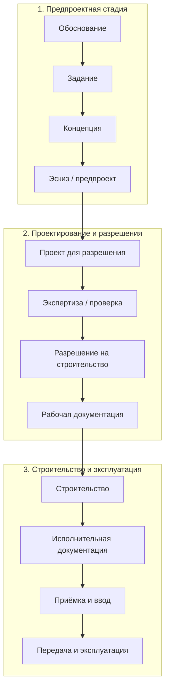

---
hide:
  - toc
---

# Стадии проектирования и строительства

!!! warning "Статус: черновик"
    Названия стадий записаны по первичному обзору и статье 2014 г. (см. [Источники](../istochniki.md)). Каждую ячейку нужно сверить с действующим текстом норматива, пока не проставлен статус **сверено**.

## Принцип построения

Строки — **объединение** стадий всех стран, а не пересечение. Если у страны есть стадия без аналога, для неё добавлена отдельная строка, а у остальных стоит «—» с пометкой, где эта работа делается у них.

**Обозначения:** ≈ полный аналог · ◐ частичный аналог · — аналога нет · 🔸 стадия есть только у одной страны

## Сводная матрица

| Сквозная стадия | 🇷🇸 Сербия | 🇷🇺 Россия | 🇪🇺 ЕС (EN 16310) | 🇬🇧 Англия (RIBA 2020) |
|---|---|---|---|---|
| Стратегия и обоснование | — (в составе предпроектных работ) | ◐ предпроектные материалы, ТЭО / обоснование инвестиций | — (вне EN 16310; см. примечание) | ≈ **0** Strategic Definition — стратегическое определение |
| Подготовка задания | ◐ *lokacijski uslovi* — локационные условия | ◐ градостроительный план земельного участка, технические условия, задание на проектирование | — | ≈ **1** Preparation and Briefing — подготовка и формирование задания |
| Концепция | ≈ *idejno rešenje* — идейное решение | ≈ концепция проекта (ГОСТ Р 55654) | ≈ Preliminary Design — предварительное проектирование | ≈ **2** Concept Design — концептуальное проектирование |
| Эскиз / предварительный проект | ≈ *idejni projekat* — эскизный проект | ≈ предварительный проект (ГОСТ Р 55654) | ≈ Scheme Design — эскизное проектирование | ◐ **2** Concept Design (окончание) |
| Проект для разрешения | ≈ *projekat za građevinsku dozvolu* — проект для разрешения на строительство | ≈ проектная документация | ≈ Technical Design — техническое проектирование | ◐ **3** Spatial Coordination — пространственная координация; подача на planning permission |
| Проверка / экспертиза проекта | ◐ *tehnička kontrola projekta* — техническая проверка проекта | 🔸 государственная или негосударственная экспертиза проектной документации и результатов инженерных изысканий | — (определяется национальным правом) | ◐ согласование Building Control; для high-risk зданий — гейты Building Safety Regulator |
| Разрешение на строительство | ≈ *građevinska dozvola* — разрешение на строительство | ≈ разрешение на строительство | — (национальное право) | ◐ planning permission + Building Regulations approval |
| Рабочая документация | ≈ *projekat za izvođenje* — проект для производства работ | ≈ рабочая документация | ≈ Production Information — информация для производства работ | ≈ **4** Technical Design — техническое проектирование |
| Строительство | ≈ *izvođenje radova* — производство работ (с *prijava radova* — уведомлением о начале) | ≈ строительство, строительный контроль, государственный строительный надзор | ≈ Construction — строительство | ≈ **5** Manufacturing and Construction — изготовление и строительство |
| Исполнительная документация | ≈ *projekat izvedenog objekta* — проект построенного объекта | ≈ исполнительная документация | — | ◐ as-built information (в составе стадии 6) |
| Приёмка и разрешение на ввод | ≈ *tehnički pregled* — техническая приёмка; *upotrebna dozvola* — разрешение на использование | ≈ заключение о соответствии, разрешение на ввод в эксплуатацию | — (национальное право) | ◐ completion certificate / final certificate |
| Передача заказчику | — | ◐ передача объекта заказчику | ◐ Handover | ≈ **6** Handover — передача объекта |
| Эксплуатация | — (вне регулирования стадий) | ◐ эксплуатация зданий (отдельное регулирование) | ◐ Use (вне объёма стадий) | 🔸 **7** Use — эксплуатация (внутри Plan of Work) |

!!! note "Как читать"
    Ячейки с **—** означают, что отдельной стадии в этой системе нет. Это не значит, что работа не выполняется: она может входить в соседнюю стадию или регулироваться национальным правом. Уточняется в карточках стран.

## Стадии, не имеющие аналога у остальных

| Стадия | Страна | Чем отличается |
|---|---|---|
| Стратегическое определение (RIBA 0) | 🇬🇧 | Отдельная стадия до формирования задания |
| Экспертиза проектной документации | 🇷🇺 | Обязательная процедура вне проектных стадий, отдельный орган и заключение |
| Стадия эксплуатации (RIBA 7) | 🇬🇧 | Входит в план работ архитектора |
| Гейты Building Safety Regulator | 🇬🇧 | Только для зданий повышенной категории риска |
| Локационные условия | 🇷🇸 | Предшествуют проектированию, выдаются органом |

## Схема

## Что предстоит сверить

- [ ] EN 16310:2013 — состав подстадий и пометки Design
- [ ] ГОСТ Р 55654-2013, ГОСТ Р 21.1101 — актуальная редакция; ГрК РФ, ПП РФ № 87
- [ ] Сербия: закон о планировании и строительстве и правилник о содержании технической документации — названия и состав проектов
- [ ] RIBA Plan of Work 2020 — названия стадий, планируемые соответствия
- [ ] Британские гейты Building Safety Regulator: условия применимости
